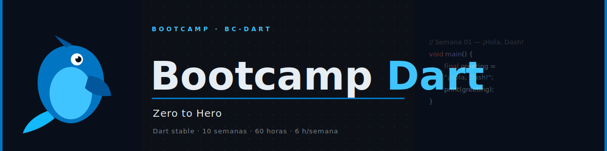

<p align="center">
  
</p>

<p align="center">
  <a href="LICENSE"></a>
  <a href="#"></a>
  <a href="#"></a>
  <a href="#"></a>
</p>

<p align="center">
  <a href="README_EN.md"></a>
</p>

---

## 📋 Descripción

Bootcamp intensivo de **10 semanas (~2.5 meses)** enfocado en **Dart puro** — el lenguaje, sin
ningún framework encima. Diseñado para llevar a desarrolladores con **experiencia previa en
programación (POO, control de flujo, funciones) pero sin Dart** hasta un dominio profundo del
lenguaje: null safety, colecciones, POO avanzada, genéricos, pattern matching, asincronía,
testing y empaquetado — con la última semana como puente explícito hacia
[`bc-flutter`](https://github.com/ergrato-dev/bc-flutter).

### 🎯 Objetivos

Al finalizar el bootcamp, los estudiantes serán capaces de:

- ✅ Dominar null safety y el sistema de tipos de Dart (`var/final/const`, `?`, `??`, `late`)
- ✅ Escribir funciones idiomáticas: closures, parámetros nombrados/opcionales, arrow functions
- ✅ Manipular colecciones (`List/Set/Map`) con operadores funcionales (`map/where/fold/reduce`)
- ✅ Diseñar clases con constructores `const`/`factory`, herencia, mixins y extension methods
- ✅ Usar genéricos, records y pattern matching (`switch` con destructuring, sealed classes)
- ✅ Manejar errores con excepciones custom y el patrón Result
- ✅ Escribir código asíncrono con `Future`/`async`/`await`, `Stream` e `Isolate`
- ✅ Testear código con `dart test`, empaquetar con `pub`, y trabajar con JSON y `dart:io`
- ✅ Diseñar una arquitectura en capas (domain/data/state) reutilizable en Flutter

### 🚀 ¿Por qué Dart puro antes de Flutter?

> **Domina el lenguaje antes del framework** — null safety, async y POO se aprenden mejor sin
> la carga cognitiva simultánea de widgets, layout y el ciclo de vida de una app móvil.

Este bootcamp sigue el mismo patrón "lenguaje puente → framework" usado en otros bootcamps de
este catálogo (ej. TypeScript antes de React). `bc-flutter/week-01` ya cubre una introducción
autocontenida de 16h a Dart — este repo no la reemplaza: va mucho más profundo (genéricos,
records/pattern matching, sealed classes, isolates, testing, packaging) de lo que esas 16h
introductorias cubren, y ambos bootcamps son completables de forma independiente.

---

## 🗓️ Estructura del Bootcamp

|              Fase              | Semanas | Horas | Temas Principales                                                          |
| :-----------------------------: | :-----: | :---: | --------------------------------------------------------------------------- |
| **Fundamentos del Lenguaje**     |   1-2   |  12h  | Entorno/tooling, variables, null safety, control de flujo, funciones        |
| **POO y Tipos Avanzados**        |   3-6   |  24h  | Colecciones, clases, herencia/mixins/extensiones, genéricos, pattern matching |
| **Manejo de Errores y Asincronía** | 7-8  |  12h  | Excepciones, patrón Result, Future/async/await, Streams, isolates           |
| **Herramientas y Proyecto Final**| 9-10    |  12h  | Testing, paquetes/pub, JSON, CLI apps, proyecto puente a bc-flutter          |

**Total: 10 semanas** | **60 horas** de formación intensiva

---

## 📚 Contenido por Semana

Cada semana incluye:

```
bootcamp/week-XX-tema_principal/
├── README.md                 # Descripción y objetivos
├── rubrica-evaluacion.md     # Criterios de evaluación
├── 0-assets/                 # Imágenes y diagramas
├── 1-teoria/                 # Material teórico
├── 2-practicas/              # Ejercicios guiados
├── 3-proyecto/               # Proyecto semanal
├── 4-recursos/               # Recursos adicionales
│   ├── ebooks-free/
│   ├── videografia/
│   └── webgrafia/
└── 5-glosario/               # Términos clave
```

Ver el temario semana a semana completo en [docs/plan-estudios.md](docs/plan-estudios.md).

### 🔑 Componentes Clave

- 📖 **Teoría**: Conceptos fundamentales con ejemplos del mundo real
- 💻 **Práctica**: Ejercicios progresivos y proyectos hands-on
- 📝 **Evaluación**: Evidencias de conocimiento, desempeño y producto
- 🎓 **Recursos**: Glosarios, referencias y material complementario

---

## 🛠️ Stack Tecnológico

| Tecnología          | Uso                                  |
| -------------------- | ------------------------------------- |
| Dart (canal stable)   | Lenguaje único del curso (null safety)|
| `test`                 | Testing unitario                     |
| `args`                 | Parseo de argumentos de CLI          |
| `path`                 | Manipulación de rutas multiplataforma|
| `lints`                | Reglas de análisis estático          |
| Docker / Docker Compose | Entorno reproducible (100% del flujo, sin limitación de GUI) |
| GitHub Actions          | Auto-gestión de PRs externas       |

> Versiones exactas pineadas y calendario de auditoría en [docs/stack-versions.md](docs/stack-versions.md) — se fijan al iniciar cada cohorte para garantizar reproducibilidad.

**Entorno de desarrollo**: Docker (100% del flujo: run/analyze/test/build) **o** Dart SDK local — ambas rutas son igualmente válidas, ver [docs/setup/README.md](docs/setup/README.md).

> 🐳 A diferencia de `bc-flutter`, aquí Docker **no tiene ninguna limitación de GUI**: un
> programa de consola en Dart corre igual dentro del contenedor que en el host.

---
## 🚀 Inicio Rápido

### Prerrequisitos

- **Dart SDK** (canal stable) **o** **Docker 27+** + **Docker Compose 2.31+** (ver [docs/setup/README.md](docs/setup/README.md) para elegir)
- **Git** para control de versiones
- **VS Code** (recomendado) con extensiones incluidas
- Conocimientos básicos de programación orientada a objetos (no requiere Dart previo)

### 1. Clonar el Repositorio

```bash
git clone https://github.com/ergrato-dev/bc-dart.git
cd bc-dart
```

### 2. Instalar Extensiones de VS Code

```bash
# Abrir en VS Code
code .

# Las extensiones recomendadas aparecerán automáticamente
# O ejecutar: Ctrl+Shift+P → "Extensions: Show Recommended Extensions"
```

### 3. Navegar a la Semana Actual

```bash
cd bootcamp/week-01-fundamentos_dart_y_entorno
```

### 4. Seguir las Instrucciones

Cada semana contiene un `README.md` con instrucciones detalladas.

### 5. Validar tu Código

```bash
# Con Docker
docker compose run --rm dart dart analyze
docker compose run --rm dart dart test

# Con SDK local
dart analyze
dart test
```

Ver [docs/setup/README.md](docs/setup/README.md) para el flujo completo.

---

## 📊 Metodología de Aprendizaje

### Estrategias Didácticas

- 🎯 **Aprendizaje Basado en Proyectos (ABP)**
- 🏛️ **Dominios Únicos**: Cada aprendiz aplica conceptos a su dominio asignado (anticopia)
- 🧩 **Práctica Deliberada**
- 🌉 **Lenguaje-Puente**: profundidad real en Dart antes de introducir cualquier framework
- 👥 **Code Review entre pares**
- 🎮 **Live Coding**

### Distribución del Tiempo (6h/semana)

- **Teoría**: 2 horas
- **Prácticas**: 2 horas
- **Proyecto**: 2 horas

### Evaluación

Cada semana incluye tres tipos de evidencias:

1. **Conocimiento 🧠** (30%): Cuestionarios y evaluaciones teóricas
2. **Desempeño 💪** (40%): Ejercicios prácticos en clase
3. **Producto 📦** (30%): Entregables evaluables (proyectos funcionales)

**Criterio de aprobación**: Mínimo 70% en cada tipo de evidencia. Implementación coherente con el dominio asignado. Originalidad: sin copia entre aprendices.

---

## 🏛️ Política de Dominios Únicos (Anticopia)

Cada aprendiz recibe un **dominio único asignado por el instructor** desde la primera clase, que
usa en todos los proyectos del bootcamp. Los dominios **no se definen en este repo**: se asignan
y trackean con la app `sena/eval-semanal` sobre el catálogo compartido
`bc-sql/scripts/assign_domains.py` (150 dominios, 15 reservados para ejemplos). El dominio
canónico usado en toda la teoría/ejemplos de este repo es **Biblioteca** — nunca asignado a un
estudiante.

**Objetivo:**

- ✅ Prevenir copia entre estudiantes
- ✅ Fomentar implementaciones originales
- ✅ Aplicar conceptos generales a contextos específicos
- ✅ Desarrollar capacidad de abstracción y adaptación

**Responsabilidades del instructor:**

1. Asignar un dominio único a cada aprendiz al inicio (vía `sena/eval-semanal`)
2. Mantener registro de dominios asignados
3. No repetir dominios en el mismo grupo
4. Validar coherencia con el dominio en evaluaciones

---

## 📞 Soporte

- 💬 **Discussions**: [GitHub Discussions](https://github.com/ergrato-dev/bc-dart/discussions)
- 🐛 **Issues**: [GitHub Issues](https://github.com/ergrato-dev/bc-dart/issues)

---

## ⚠️ Exención de Responsabilidad

Este repositorio es un recurso **educativo** creado con fines de aprendizaje. Al utilizarlo, aceptas los siguientes términos:

- **Solo fines educativos**: El contenido, los ejemplos de código y los proyectos están diseñados exclusivamente para la enseñanza y el aprendizaje. No constituyen asesoramiento profesional, legal ni de seguridad.
- **Sin garantías**: El material se proporciona **"tal cual"**, sin garantías de ningún tipo, expresas o implícitas, incluyendo idoneidad para un propósito particular o ausencia de errores.
- **Código en producción**: Los ejemplos de código son ilustrativos. Antes de usarlos en entornos productivos, debes realizar revisiones de seguridad, rendimiento y adaptación a tu contexto específico.
- **Versiones de software**: Las versiones de librerías y herramientas mencionadas pueden quedar desactualizadas. Siempre consulta la documentación oficial más reciente.
- **Limitación de responsabilidad**: Los autores y contribuidores no se responsabilizan por pérdidas de datos, daños directos o indirectos, interrupciones de servicio ni cualquier otro perjuicio derivado del uso de este material.
- **Responsabilidad del estudiante**: Cada estudiante es responsable de sus propias implementaciones, entornos de desarrollo y decisiones técnicas.

---

## 📄 Licencia

Este proyecto está bajo la licencia **[CC BY-NC-SA 4.0](https://creativecommons.org/licenses/by-nc-sa/4.0/)** (Creative Commons Attribution-NonCommercial-ShareAlike 4.0 International).

**Puedes:** compartir y adaptar el material, incluso crear forks educativos.<br>
**No puedes:** usar este material con fines comerciales.<br>
**Debes:** dar crédito apropiado y distribuir las adaptaciones bajo la misma licencia.

Ver el archivo [LICENSE](LICENSE) para el texto completo.

---

## 🏆 Agradecimientos

- [Dart](https://dart.dev/) — Por el lenguaje
- Comunidad Dart — Por los recursos y ejemplos
- Todos los contribuidores

---

## 📚 Documentación Adicional

- [🤖 Instrucciones de Copilot](.github/copilot-instructions.md)
- [📜 Código de Conducta](CODE_OF_CONDUCT.md)
- [🔒 Política de Seguridad](SECURITY.md)
- [🗓️ Plan de Estudios Detallado](docs/plan-estudios.md)

---

<p align="center">
  <strong>🎓 Bootcamp Dart - Zero to Hero</strong><br>
  <em>De cero conocimiento de Dart a dominio profundo del lenguaje en 2.5 meses</em>
</p>

<p align="center">
  <a href="bootcamp/week-01-fundamentos_dart_y_entorno">Comenzar Semana 1</a> •
  <a href="https://github.com/ergrato-dev/bc-dart/issues">Reportar Issue</a>
</p>

<p align="center">
  Hecho con ❤️ para la comunidad de desarrolladores
</p>
