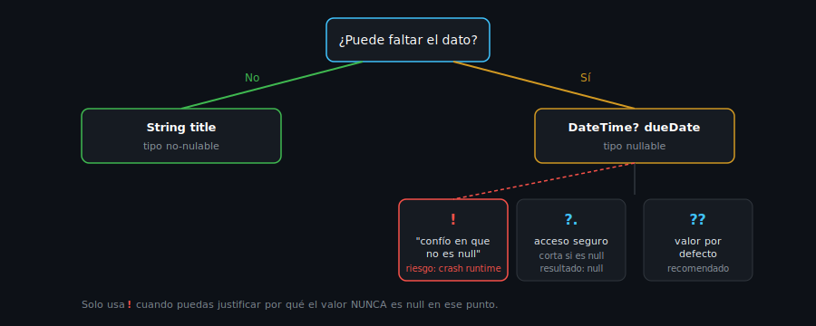

# Null Safety

## 🎯 Objetivos

Al finalizar este archivo, comprenderás:

- Qué es el "sound null safety" de Dart y qué problema resuelve
- Los operadores `?`, `?.`, `??`, `??=` y `!`, y cuándo usar cada uno
- Qué hace `late` y por qué es una promesa que puede romperse en runtime
- Por qué `!` es el operador más peligroso del grupo



## 📋 Conceptos Clave

### 1. El problema que resuelve null safety

Antes de null safety, cualquier variable podía ser `null` en cualquier momento, sin que el
compilador lo señalara — el clásico `NullPointerException` de Java o `Cannot read property of
undefined` de JavaScript. Dart resuelve esto **en tiempo de compilación**: un tipo es no-nulable
por defecto, y solo puede contener `null` si lo declaras explícitamente con `?`.

```dart
String name = 'Dash';   // NUNCA puede ser null — el compilador lo garantiza
String? nickname;        // SÍ puede ser null — y de hecho empieza siendo null
```

> 💡 **Diferencia con TypeScript**: `strictNullChecks` en TypeScript es una opción que puedes
> desactivar; en Dart, sound null safety es parte del lenguaje desde Dart 3 — no hay forma de
> "apagarlo" para un archivo individual.

### 2. `?.` — acceso seguro (safe navigation)

```dart
String? nickname;
print(nickname?.length); // imprime: null (NO lanza excepción)

nickname = 'Dashy';
print(nickname?.length); // imprime: 5
```

Si la variable es `null`, toda la cadena `?.` se corta y el resultado es `null` — no explota.

### 3. `??` y `??=` — valores por defecto

```dart
String? nickname;

final displayName = nickname ?? 'Sin apodo'; // 'Sin apodo' porque nickname es null
print(displayName);

nickname ??= 'Anónimo'; // asigna SOLO si nickname es null
print(nickname);         // 'Anónimo'

nickname ??= 'Otro valor'; // no hace nada: nickname ya no es null
print(nickname);            // sigue siendo 'Anónimo'
```

### 4. `!` — el operador de "confía en mí" (y su riesgo)

```dart
String? maybeNull = 'seguro';
String definitelyNotNull = maybeNull!; // "yo sé que esto no es null"
```

`!` le dice al compilador "trata este valor como no-nulable, confía en mí" — pero es una
promesa que **se verifica en runtime**. Si te equivocas y el valor sí era `null`, Dart lanza
una excepción (`TypeError`) en ese punto exacto.

> ⚠️ **Regla del bootcamp**: usa `!` solo cuando puedas justificar en un comentario por qué
> estás 100% seguro de que el valor no es null en ese punto. Si dudas, usa `??` con un
> fallback o un `if (valor != null)` que "promueva" el tipo.

### 5. `late` — declarar sin inicializar (con una promesa)

```dart
late String description;

void loadDescription() {
  description = 'Cargado después'; // se asigna más tarde
}

// print(description); // ❌ si se accede ANTES de asignar, lanza LateInitializationError
```

`late` le dice al compilador "esta variable no-nulable se inicializará antes de usarse, aunque
no pueda probarlo estáticamente" — típico para variables que se inicializan en un `initState`
o en un paso de setup posterior al `main()`. Es, igual que `!`, una promesa verificada en
runtime: si accedes antes de asignar, el programa lanza una excepción.

### 6. Cuándo un campo debería ser nullable vs no-nulable

Pregúntate: **¿este dato puede legítimamente no existir?**

- Un título de libro → casi nunca falta → `String` (no-nulable)
- Una fecha de devolución de un libro que aún no se ha prestado → sí puede no existir →
  `DateTime?` (nulable)

Modelar esto correctamente desde el tipo es la mitad del trabajo de null safety — el resto es
manejar bien el `?` con `?.`/`??` en vez de forzar con `!` en todos lados.

## ⚠️ Errores Comunes

- Usar `!` "para que compile" sin verificar realmente que el valor no puede ser null —
  convierte un error de compilación en un crash de runtime, que es justo lo que null safety
  quería evitar
- Declarar todo como nullable (`String?` en todos lados) "por si acaso" — pierdes la garantía
  del compilador y obligas a manejar `null` en cada uso, incluso donde nunca podría pasar
- Usar `late` como atajo para evitar pensar si un campo debería ser nullable o requerido en el
  constructor

## 📚 Recursos Adicionales

- [dart.dev — Sound null safety](https://dart.dev/null-safety)
- [dart.dev — Understanding null safety](https://dart.dev/null-safety/understanding-null-safety)

## ✅ Checklist de Verificación

Antes de continuar a las prácticas, verifica que entiendes:

- [ ] La diferencia entre un tipo `String` y un tipo `String?`
- [ ] Cuándo usar `?.`, `??` y `??=`
- [ ] Por qué `!` puede lanzar una excepción en runtime, y cuándo se justifica usarlo
- [ ] Qué garantiza (y qué no garantiza) `late`
