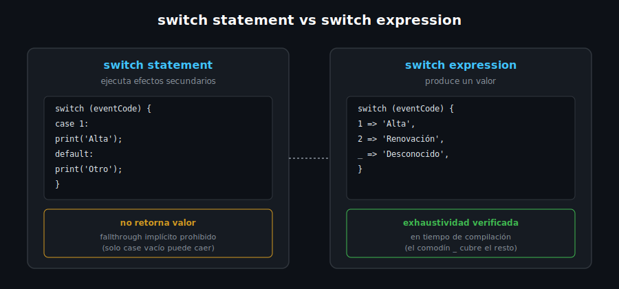

# Condicionales: if/else y switch

## 🎯 Objetivos

Al finalizar este archivo, comprenderás:

- `if`/`else` y el operador ternario `? :`
- `switch` **statement** clásico: `case`, agrupación de labels, `default`
- `switch` **expression** (Dart 3): devuelve un valor, exhaustividad verificada en compilación
- Cuándo preferir expression sobre statement



## 📋 Conceptos Clave

### 1. `if`/`else` y el operador ternario

```dart
int copies = 0;

if (copies > 0) {
  print('Disponible');
} else {
  print('Agotado');
}

// Ternario: útil solo para expresiones cortas de una sola decisión
final status = copies > 0 ? 'Disponible' : 'Agotado';
```

> 💡 **Comparación con otros lenguajes**: el ternario de Dart es idéntico al de JavaScript/Java/C.
> No existe un operador `elvis` (`?:`) separado — para eso Dart usa `??` (ver semana 01).

### 2. `switch` statement — el clásico, con reglas más estrictas que C/JS

```dart
const eventCode = 2;

switch (eventCode) {
  case 1:
    print('Alta');
  case 2:
  case 3: // dos labels comparten el mismo cuerpo — SÍ es fallthrough explícito válido
    print('Movimiento');
  default:
    print('Desconocido');
}
```

A diferencia de C o JavaScript, Dart **prohíbe el fallthrough implícito**: cada `case` con cuerpo
propio debe terminar en `break`, `continue`, `return` o `throw` (o simplemente no tener más
código después, como arriba). Solo se permite "caer" de un `case` a otro cuando el `case` de
arriba está **vacío** — eso es fallthrough intencional y válido.

### 3. `switch` expression (Dart 3) — devuelve un valor, exhaustivo

```dart
String describeEvent(int eventCode) => switch (eventCode) {
  1 => 'Alta',
  2 => 'Renovación',
  3 => 'Baja',
  _ => 'Desconocido', // comodín: obligatorio si no cubres todos los casos posibles
};
```

El analyzer **exige exhaustividad**: si quitas el `_` y no cubres todos los valores posibles de
`int`, no compila. Esto evita el bug clásico de un `switch` statement al que se le olvidó un
`case` y termina cayendo silenciosamente al comportamiento por defecto.

> 💡 **Comparación con TypeScript**: el chequeo de exhaustividad de Dart en `switch` expression es
> comparable al de un `union type` con `never` en TypeScript, pero es parte del lenguaje sin
> configuración adicional.

### 4. Ejemplo aplicado al dominio del curso (Biblioteca)

```dart
String loanStatusLabel(int daysOverdue) => switch (daysOverdue) {
  0 => 'Al día',
  < 0 => 'Aún no vence', // patrón relacional: cualquier valor negativo
  _ => 'Vencido ($daysOverdue días)',
};

void main() {
  print(loanStatusLabel(0));  // Al día
  print(loanStatusLabel(-3)); // Aún no vence
  print(loanStatusLabel(5));  // Vencido (5 días)
}
```

Los **patrones relacionales** (`< 0`, `>= 18`, etc.) dentro de un `case` son parte del pattern
matching de Dart 3 — aquí solo se usa lo mínimo necesario; el resto (destructuring, records,
sealed classes) se profundiza en la semana 6.

### 5. Cuándo usar cada uno

- **`switch` expression**: cuando el objetivo es *mapear* un valor a otro (como las funciones de
  arriba) — preferir esta forma, es más corta y más segura (exhaustividad).
- **`switch` statement**: cuando cada rama ejecuta *efectos secundarios* distintos (imprimir,
  mutar estado, lanzar excepciones distintas) en vez de simplemente producir un valor.

## ⚠️ Errores Comunes

- Olvidar el comodín `_` en un `switch` expression sobre un tipo con muchos valores posibles
  (`int`, `String`) — el analyzer marca error de exhaustividad no cubierta
- Escribir `break` en un `switch` **expression** — no aplica ahí, solo en el statement clásico
- Asumir fallthrough implícito estilo C en un `switch` statement con cuerpo no vacío — Dart lo
  rechaza en tiempo de compilación

## 📚 Recursos Adicionales

- [dart.dev — Branches (if, switch)](https://dart.dev/language/branches)
- [dart.dev — Patterns](https://dart.dev/language/patterns)

## ✅ Checklist de Verificación

Antes de continuar a las prácticas, verifica que entiendes:

- [ ] Cuándo usar `if`/`else` vs el operador ternario
- [ ] Por qué Dart no permite fallthrough implícito en `switch` statement
- [ ] Cómo escribir un `switch` expression exhaustivo y para qué sirve el comodín `_`
- [ ] Cuándo elegir `switch` expression sobre `switch` statement
