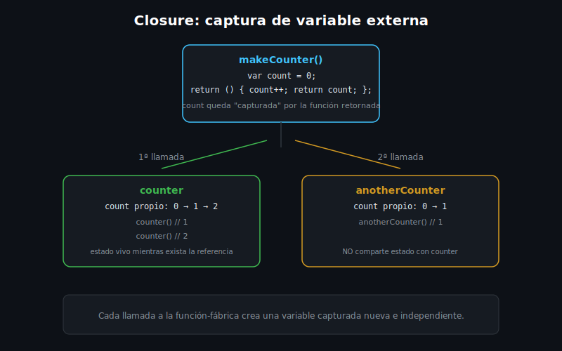

# Closures y Funciones de Orden Superior

## 🎯 Objetivos

Al finalizar este archivo, comprenderás:

- Que en Dart las funciones son **valores de primera clase** (se asignan, se pasan, se retornan)
- Funciones anónimas (sin nombre)
- Qué es un **closure** y qué variable "captura"
- Funciones de orden superior: reciben y/o retornan otras funciones



## 📋 Conceptos Clave

### 1. Funciones como valores de primera clase

```dart
int square(int n) => n * n;

void main() {
  final operation = square; // se asigna a una variable, como cualquier valor
  print(operation(4));       // 16
}
```

El tipo de `operation` es `int Function(int)` — Dart puede inferirlo, pero también puedes
anotarlo explícitamente cuando aporte claridad.

### 2. Funciones anónimas

```dart
final double_ = (int n) => n * 2; // función anónima asignada a una variable

void applyToEach(List<int> values, void Function(int) action) {
  for (final v in values) {
    action(v);
  }
}

void main() {
  applyToEach([1, 2, 3], (n) => print('Valor: $n')); // función anónima como argumento
}
```

### 3. Closures — funciones que "recuerdan" su entorno

```dart
Function makeCounter() {
  var count = 0;         // variable capturada
  return () {
    count++;              // cada llamada al closure modifica ESTA MISMA variable
    return count;
  };
}

void main() {
  final counter = makeCounter();
  print(counter()); // 1
  print(counter()); // 2

  final anotherCounter = makeCounter(); // instancia independiente
  print(anotherCounter()); // 1 — no comparte estado con `counter`
}
```

Un **closure** es una función que captura variables de su entorno léxico (el scope donde fue
creada) y las conserva vivas incluso después de que esa función que las declaró (`makeCounter`)
haya terminado de ejecutarse. Cada llamada a `makeCounter()` crea una variable `count` **nueva e
independiente**.

> 💡 **Comparación con JavaScript**: el concepto es idéntico al de closures en JS. La diferencia
> práctica es que, en un `for` de Dart, la variable de control declarada con `for (var i ...)`
> tiene un binding nuevo por iteración (como `let` en JS moderno) — así que capturar `i` dentro de
> un closure creado en cada vuelta funciona de forma intuitiva, sin el bug clásico del `var` de
> JavaScript antiguo.

### 4. Funciones de orden superior — reciben y/o retornan funciones

```dart
// Recibe una función como parámetro
bool anyOverdue(List<int> daysList, bool Function(int) predicate) {
  for (final days in daysList) {
    if (predicate(days)) return true;
  }
  return false;
}

// Retorna una función (closure) configurada con un parámetro
bool Function(int) makeOverdueChecker(int threshold) {
  return (days) => days > threshold;
}

void main() {
  final isSeverelyOverdue = makeOverdueChecker(30);
  print(isSeverelyOverdue(45)); // true
  print(isSeverelyOverdue(10)); // false
}
```

`makeOverdueChecker` es una **fábrica de funciones**: retorna un closure distinto según el
`threshold` con el que se llamó, sin necesitar una clase para guardar esa configuración — este
patrón se retoma con más fuerza en la semana 3 (`where`, `map`, etc. reciben funciones así).

## ⚠️ Errores Comunes

- Confundir "función anónima" con "closure" — toda función en Dart es potencialmente un closure
  (si captura algo de su entorno); anónima solo describe que no tiene nombre propio
- Esperar que dos llamadas a una función-fábrica (como `makeCounter()`) compartan estado — cada
  llamada crea variables capturadas **nuevas e independientes**
- Anotar el tipo de una función de orden superior de forma incorrecta (ej. olvidar el tipo de
  retorno del `Function` recibido como parámetro)

## 📚 Recursos Adicionales

- [dart.dev — Functions (anonymous functions, closures)](https://dart.dev/language/functions)

## ✅ Checklist de Verificación

Antes de continuar a las prácticas, verifica que entiendes:

- [ ] Por qué una función se puede asignar a una variable y pasar como argumento
- [ ] Qué variable "captura" un closure y por qué sigue viva después
- [ ] Que cada llamada a una función-fábrica produce un closure con estado independiente
