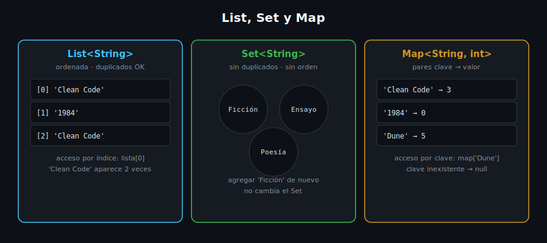

# Listas y Sets

## 🎯 Objetivos

Al finalizar este archivo, comprenderás:

- Cómo declarar, leer y mutar una `List`
- Qué es un `Set` y qué problema resuelve (unicidad)
- Cuándo elegir `List` sobre `Set` (y viceversa)
- Operaciones básicas: `add`, `remove`, `contains`, `length`



## 📋 Conceptos Clave

### 1. `List` — colección ordenada, permite duplicados

```dart
final genres = <String>['Ficción', 'Ensayo', 'Poesía'];

genres.add('Historia');           // agrega al final
print(genres[0]);                  // acceso por índice: 'Ficción'
print(genres.length);              // 4
print(genres.contains('Poesía'));  // true

genres.removeAt(1);                // quita por índice
print(genres);                     // [Ficción, Poesía, Historia]
```

Una `List` mantiene **orden de inserción** y **permite valores repetidos**. El tipo se declara
con genéricos: `List<String>`, `List<int>`, etc. — el analyzer rechaza insertar un valor de otro
tipo.

> 💡 **Comparación con otros lenguajes**: `List<T>` de Dart equivale a `Array` de JavaScript o
> `list` de Python, pero con tipado fuerte verificado en compilación — no puedes mezclar tipos
> sin pasar por `List<Object>` explícitamente.

### 2. Listas `const` vs `final` — inmutabilidad real

```dart
final mutableList = [1, 2, 3];
mutableList.add(4);           // ✅ válido: la lista SÍ puede mutar

const fixedList = [1, 2, 3];
// fixedList.add(4);          // ❌ Error: no se puede modificar una lista const
```

`final` fija la **referencia** (no puedes reasignar la variable), pero el contenido de la lista
sigue siendo mutable. `const` congela también el contenido — útil para catálogos fijos que nunca
cambian en runtime.

### 3. `Set` — colección sin duplicados, sin orden garantizado

```dart
final activeGenres = <String>{'Ficción', 'Ensayo'};

activeGenres.add('Ficción'); // ya existe: el duplicado se ignora
print(activeGenres.length);  // 2

activeGenres.add('Poesía');
print(activeGenres.contains('Ensayo')); // true
```

Un `Set` garantiza que cada elemento aparece **una sola vez** — agregar un valor ya existente no
hace nada. Es la estructura idónea cuando la unicidad es la regla de negocio (ej. géneros
únicos que tiene un autor, IDs sin repetir).

> ⚠️ **Nota del analyzer**: si escribes el duplicado directamente en el literal (ej.
> `{'Ficción', 'Ensayo', 'Ficción'}`), el analyzer lo marca con la advertencia
> `equal_elements_in_set` — porque puede detectarlo en tiempo de análisis. Usar `.add()` para
> demostrar la deduplicación en runtime, como arriba, evita esa advertencia.

> ⚠️ **Importante**: `{}` vacío es un `Map`, no un `Set` — para un `Set` vacío usa `<String>{}`
> o `Set<String>()`.

### 4. Ejemplo aplicado al dominio del curso (Biblioteca)

```dart
void main() {
  final availableTitles = <String>['Clean Code', '1984', 'Clean Code']; // permite duplicado
  final uniqueGenres = <String>{'Ficción', 'Distopía', 'Ficción'};       // deduplica solo

  print('Títulos en lista (con duplicado): $availableTitles');
  print('Géneros únicos: $uniqueGenres');
}
```

### 5. Cuándo usar `List` vs `Set`

- **`List`**: cuando el **orden importa** o los **duplicados son válidos** (una cola de espera,
  un historial de eventos).
- **`Set`**: cuando la **unicidad es la regla** y el orden no importa (etiquetas, categorías,
  IDs ya vistos).

## ⚠️ Errores Comunes

- Usar `{}` esperando un `Set` vacío — sin tipo explícito, Dart lo interpreta como `Map`
- Intentar `.add()` sobre una lista `const` — error de compilación, no de runtime
- Acceder a un índice fuera de rango (`lista[10]` en una lista de 3 elementos) — lanza
  `RangeError` en runtime, no hay chequeo estático de límites

## 📚 Recursos Adicionales

- [dart.dev — Collections](https://dart.dev/language/collections)
- [dart.dev — Lists](https://dart.dev/language/collections#lists)
- [dart.dev — Sets](https://dart.dev/language/collections#sets)

## ✅ Checklist de Verificación

Antes de continuar a las prácticas, verifica que entiendes:

- [ ] Cómo agregar, leer y eliminar elementos de una `List`
- [ ] Por qué un `Set` nunca tiene duplicados
- [ ] La diferencia entre una lista `final` (mutable) y una `const` (inmutable)
- [ ] Cuándo elegir `List` sobre `Set`, y cómo declarar un `Set` vacío
