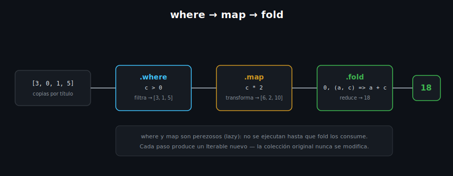

# Operadores Funcionales: map, where, fold, reduce

## 🎯 Objetivos

Al finalizar este archivo, comprenderás:

- `map` — transformar cada elemento de un `Iterable`
- `where` — filtrar elementos según una condición
- `fold` — reducir a un único valor con un acumulador inicial
- `reduce` — reducir a un único valor sin acumulador inicial explícito
- Encadenar (`chaining`) varias operaciones funcionales



## 📋 Conceptos Clave

### 1. `map` — transformar, uno a uno

```dart
final titles = ['clean code', '1984', 'dune'];

final capitalized = titles.map((t) => t.toUpperCase()).toList();
print(capitalized); // [CLEAN CODE, 1984, DUNE]
```

`map` retorna un `Iterable` **perezoso** (lazy) — la transformación no ocurre hasta que algo
consume el resultado (ej. `.toList()`, un `for-in`, o `print` sobre el iterable). Por eso casi
siempre se encadena `.toList()` cuando quieres el resultado como `List` concreta.

### 2. `where` — filtrar según un predicado

```dart
final copies = [3, 0, 1, 0, 5];

final available = copies.where((c) => c > 0).toList();
print(available); // [3, 1, 5]
```

`where` recibe una función que retorna `bool` (un predicado) y conserva solo los elementos donde
esa función es `true` — al igual que `map`, es perezoso.

### 3. `fold` — reducir con un valor inicial explícito

```dart
final copies = [3, 0, 1, 5];

final total = copies.fold<int>(0, (accumulator, current) => accumulator + current);
print(total); // 9
```

`fold` recorre la colección acumulando un resultado, empezando desde el valor inicial que le des
(`0` aquí). Es la forma más segura de reducir: funciona incluso sobre una colección **vacía**
(retorna el valor inicial sin errores).

### 4. `reduce` — reducir sin valor inicial (usa el primer elemento)

```dart
final copies = [3, 0, 1, 5];

final total = copies.reduce((accumulator, current) => accumulator + current);
print(total); // 9

// final emptyTotal = <int>[].reduce((a, b) => a + b); // ❌ lanza excepción: lista vacía
```

`reduce` usa el **primer elemento** de la colección como punto de partida — por eso lanza una
excepción (`StateError`) si la colección está vacía. Prefiere `fold` cuando la colección podría
estar vacía; usa `reduce` solo cuando ya garantizaste que tiene al menos un elemento.

### 5. Encadenar operaciones — el patrón más común

```dart
final inventory = <String, int>{
  'Clean Code': 3,
  '1984': 0,
  'Dune': 5,
};

final availableTitlesUpper = inventory.entries
    .where((entry) => entry.value > 0)
    .map((entry) => entry.key.toUpperCase())
    .toList();

print(availableTitlesUpper); // [CLEAN CODE, DUNE]
```

Encadenar `where` → `map` → `toList` (u otro método terminal) es el estilo idiomático de Dart
para procesar colecciones — reemplaza bucles `for` con `if` y variables acumuladoras manuales,
siendo más declarativo: describe **qué** quieres, no **cómo** iterarlo paso a paso.

## ⚠️ Errores Comunes

- Olvidar `.toList()` (o `.toSet()`) después de `map`/`where` y luego intentar usar el resultado
  como si ya fuera una `List` concreta (ej. indexar con `[]`) — un `Iterable` perezoso no
  garantiza acceso indexado directo eficiente
- Usar `reduce` sobre una colección que podría estar vacía — usa `fold` con un valor inicial en
  su lugar
- Encadenar demasiadas operaciones sin nombres intermedios cuando la legibilidad se pierde — está
  bien extraer un paso a una variable con nombre si la cadena crece demasiado

## 📚 Recursos Adicionales

- [dart.dev — Iterable collections](https://dart.dev/language/collections#iterables)
- [dart.dev API — Iterable class](https://api.dart.dev/stable/dart-core/Iterable-class.html)

## ✅ Checklist de Verificación

Antes de continuar a las prácticas, verifica que entiendes:

- [ ] La diferencia entre `map` (transforma) y `where` (filtra)
- [ ] Por qué `fold` es más seguro que `reduce` sobre colecciones que pueden estar vacías
- [ ] Cómo encadenar `where`/`map`/`toList` para procesar una colección en un solo flujo
