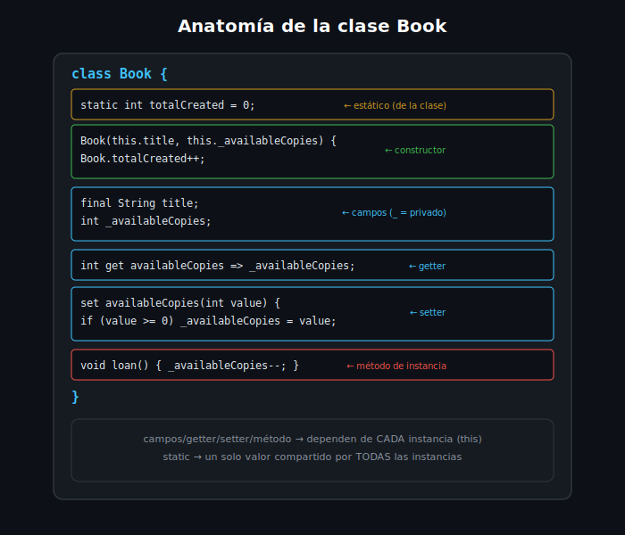

# Clases y Objetos

## 🎯 Objetivos

Al finalizar este archivo, comprenderás:

- Cómo declarar una clase con campos y un constructor básico
- La sintaxis abreviada `this.campo` en el constructor
- Cómo instanciar un objeto y acceder a sus miembros
- Cómo sobrescribir `toString()` para una representación legible



## 📋 Conceptos Clave

### 1. Declarar una clase con campos y constructor

```dart
class Book {
  Book(this.title, this.author);

  final String title;
  final String author;
}

void main() {
  final book = Book('Clean Code', 'Robert C. Martin');
  print(book.title);  // Clean Code
  print(book.author); // Robert C. Martin
}
```

`this.title` en la firma del constructor es azúcar sintáctica: recibe el argumento posicional y lo
asigna directamente al campo `title` — evitas escribir `title = title` a mano dentro de un cuerpo
de constructor.

> 💡 **Comparación con otros lenguajes**: a diferencia de Java/C#, Dart no requiere un `new`
> explícito para instanciar (`Book(...)` es suficiente desde Dart 2). Y a diferencia de
> JavaScript, los campos declarados con tipo (`final String title`) están **verificados en
> compilación** — no puedes asignar un valor de otro tipo por accidente.

### 2. Campos `final` como regla por defecto

```dart
class Book {
  Book(this.title, this.author, this.availableCopies);

  final String title;
  final String author;
  int availableCopies; // mutable a propósito: cambia con cada préstamo/devolución
}

void main() {
  final book = Book('1984', 'George Orwell', 3);
  book.availableCopies--; // válido: no es final
  print(book.availableCopies); // 2
}
```

Igual que con variables locales (semana 1), prefiere `final` para campos que no deberían cambiar
tras construir el objeto — solo deja un campo mutable cuando de verdad representa un **estado**
que cambia durante la vida del objeto.

### 3. Instanciar y usar métodos

```dart
class Book {
  Book(this.title, this.availableCopies);

  final String title;
  int availableCopies;

  bool get isAvailable => availableCopies > 0; // getter, se profundiza en el archivo 3

  void loan() {
    if (!isAvailable) {
      throw StateError('No hay copias disponibles de $title');
    }
    availableCopies--;
  }
}

void main() {
  final book = Book('Dune', 1);
  book.loan();
  print(book.availableCopies); // 0
}
```

Un **método** es una función declarada dentro de la clase — tiene acceso directo a los campos de
la instancia (`this` es implícito: `availableCopies` dentro de `loan()` se refiere al campo del
objeto actual).

### 4. Sobrescribir `toString()`

```dart
class Book {
  Book(this.title, this.author);

  final String title;
  final String author;

  @override
  String toString() => '$title — $author';
}

void main() {
  final book = Book('Clean Code', 'Robert C. Martin');
  print(book); // Clean Code — Robert C. Martin (en vez de "Instance of 'Book'")
}
```

Sin sobrescribir `toString()`, `print(objeto)` imprime algo genérico como `Instance of 'Book'` —
poco útil para depurar. La anotación `@override` no es obligatoria para que compile, pero
`Effective Dart` la exige por claridad: documenta que estás reemplazando un método heredado de
`Object`.

## ⚠️ Errores Comunes

- Olvidar `final` en campos que nunca deberían cambiar, dejando el objeto mutable sin necesidad
- No sobrescribir `toString()` y luego confundirse con la salida genérica `Instance of '...'`
  al depurar con `print`
- Confundir un método (con paréntesis, `loan()`) con un getter (sin paréntesis, `isAvailable`) —
  se profundiza en el archivo 3

## 📚 Recursos Adicionales

- [dart.dev — Classes](https://dart.dev/language/classes)
- [dart.dev — Constructors](https://dart.dev/language/constructors)

## ✅ Checklist de Verificación

Antes de continuar a las prácticas, verifica que entiendes:

- [ ] Cómo declarar una clase con campos y un constructor usando `this.campo`
- [ ] Cuándo un campo debería ser `final` vs mutable
- [ ] Por qué sobrescribir `toString()` mejora la depuración con `print`
