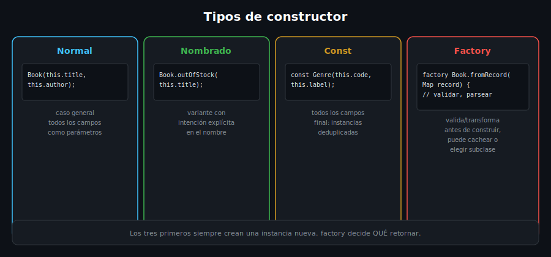

# Constructores: Nombrados, Const y Factory

## 🎯 Objetivos

Al finalizar este archivo, comprenderás:

- Constructores **nombrados**: variantes de creación con un propósito explícito
- Constructores **const**: instancias inmutables conocidas en tiempo de compilación
- Constructores **factory**: control total sobre qué instancia se retorna



## 📋 Conceptos Clave

### 1. Constructor nombrado — variantes de creación con intención clara

```dart
class Book {
  Book(this.title, this.author, this.availableCopies);

  Book.outOfStock(this.title, this.author) : availableCopies = 0;

  final String title;
  final String author;
  final int availableCopies;
}

void main() {
  final regular = Book('Clean Code', 'Robert C. Martin', 3);
  final soldOut = Book.outOfStock('1984', 'George Orwell');

  print(regular.availableCopies); // 3
  print(soldOut.availableCopies); // 0
}
```

Un constructor nombrado (`Book.outOfStock`) es otra forma de construir la **misma clase**, con un
nombre que documenta la intención. La parte después de `:` (lista de inicialización) asigna
campos `final` antes de que el cuerpo del constructor (si existiera) se ejecute.

> 💡 **Comparación con otros lenguajes**: Java/C# solo permiten *sobrecarga* de constructores
> (mismo nombre, distinta firma). Dart permite darles **nombres distintos**, lo que hace más
> legible el sitio de la llamada — `Book.outOfStock(...)` es más claro que adivinar qué hace un
> constructor sobrecargado con argumentos parecidos.

### 2. Constructor const — instancias inmutables, comparadas por valor

```dart
class Genre {
  const Genre(this.code, this.label);

  final String code;
  final String label;
}

void main() {
  const fiction = Genre('FIC', 'Ficción');
  const anotherFiction = Genre('FIC', 'Ficción');

  print(identical(fiction, anotherFiction)); // true: el compilador las unifica
}
```

Para que una clase tenga un constructor `const`, **todos** sus campos deben ser `final` (la
instancia entera debe ser inmutable). El compilador puede entonces **reutilizar la misma
instancia** en memoria para dos valores `const` idénticos — útil para catálogos de valores fijos
(géneros, categorías, configuraciones) que nunca cambian en runtime.

> ⚠️ Un constructor `const` no obliga a que cada instancia se cree con `const` — `Genre('FIC',
> 'Ficción')` sin la palabra `const` también es válido, solo que no obtiene la deduplicación en
> memoria.

### 3. Constructor factory — control total sobre qué se retorna

```dart
class Book {
  Book._(this.title, this.author, this.availableCopies); // constructor privado

  factory Book.fromRecord(Map<String, String> record) {
    final copies = int.tryParse(record['copies'] ?? '') ?? 0;
    return Book._(
      record['title'] ?? 'Sin título',
      record['author'] ?? 'Autor desconocido',
      copies,
    );
  }

  final String title;
  final String author;
  final int availableCopies;
}

void main() {
  final book = Book.fromRecord({'title': 'Dune', 'author': 'Frank Herbert', 'copies': '2'});
  print('${book.title}: ${book.availableCopies}'); // Dune: 2
}
```

A diferencia de un constructor normal (que **siempre** crea una instancia nueva), un `factory`
puede: validar/transformar datos de entrada antes de construir, retornar una instancia de una
**subclase**, o incluso retornar una instancia **cacheada** en vez de crear una nueva. El
constructor privado `Book._` (guion bajo) es un patrón común: fuerza a que la única forma pública
de construir el objeto sea a través del `factory`, donde ocurre la validación.

### 4. Cuándo usar cada tipo de constructor

- **Constructor normal**: el caso general, todos los campos como parámetros directos
- **Nombrado**: variantes de creación con un caso de uso específico y un nombre que lo explique
- **Const**: cuando la clase es completamente inmutable y sus instancias son "valores" fijos
- **Factory**: cuando necesitas lógica antes de construir (parsing, validación, caché,
  decidir la subclase concreta)

## ⚠️ Errores Comunes

- Intentar un constructor `const` con un campo mutable (no `final`) — error de compilación
- Usar un constructor normal cuando en realidad necesitas validar/transformar datos de entrada
  (ej. parsear un `Map` crudo) — ahí es donde un `factory` evita duplicar esa lógica en cada
  sitio de llamada
- Olvidar que un `factory` **no tiene acceso a `this`** antes de retornar — debe construir la
  instancia explícitamente (a menudo delegando a un constructor privado, como arriba)

## 📚 Recursos Adicionales

- [dart.dev — Constructors: Named constructors](https://dart.dev/language/constructors#named-constructors)
- [dart.dev — Constructors: Constant constructors](https://dart.dev/language/constructors#constant-constructors)
- [dart.dev — Constructors: Factory constructors](https://dart.dev/language/constructors#factory-constructors)

## ✅ Checklist de Verificación

Antes de continuar a las prácticas, verifica que entiendes:

- [ ] Para qué sirve un constructor nombrado frente a sobrecargar el constructor normal
- [ ] Por qué un constructor `const` exige que todos los campos sean `final`
- [ ] Qué puede hacer un constructor `factory` que uno normal no puede
