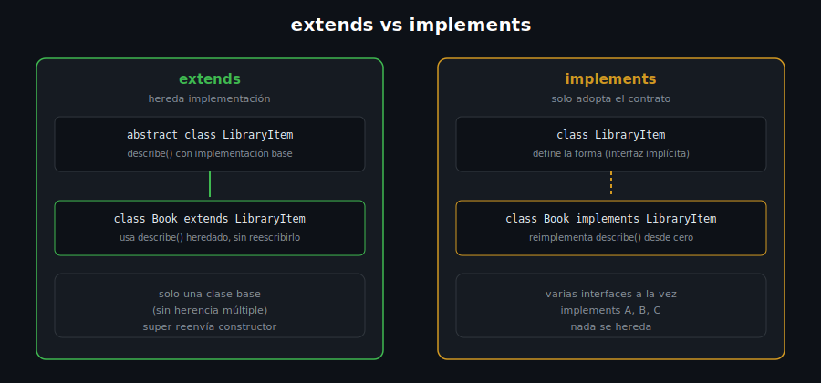

# Herencia y Clases Abstractas

## 🎯 Objetivos

Al finalizar este archivo, comprenderás:

- Cómo extender una clase con `extends` y reutilizar comportamiento
- `super`: llamar al constructor y a métodos de la clase base
- Clases y métodos **abstractos**: contratos sin implementación propia
- Polimorfismo: tratar distintas subclases a través de su tipo base



## 📋 Conceptos Clave

### 1. `extends` — heredar campos y métodos

```dart
class LibraryItem {
  LibraryItem(this.title);

  final String title;

  String describe() => 'Elemento: $title';
}

class Book extends LibraryItem {
  Book(super.title, this.author);

  final String author;
}

void main() {
  final book = Book('Clean Code', 'Robert C. Martin');
  print(book.describe()); // heredado de LibraryItem sin reescribirlo
  print(book.author);
}
```

`Book` hereda `title` y `describe()` de `LibraryItem` sin duplicar código. `super.title` en el
constructor reenvía el argumento al constructor de la clase base — sintaxis abreviada equivalente
a escribir `: super(title)`.

> 💡 **Comparación con otros lenguajes**: Dart, como Java o C#, permite **herencia simple**
> (una clase `extends` solo de otra) — para combinar comportamiento de varias fuentes se usan
> mixins (archivo 3), no herencia múltiple.

### 2. `@override` y llamar al método del padre con `super`

```dart
class LibraryItem {
  String describe() => 'Elemento genérico';
}

class Book extends LibraryItem {
  Book(this.author);

  final String author;

  @override
  String describe() => '${super.describe()} — libro de $author';
}

void main() {
  print(Book('Robert C. Martin').describe());
  // Elemento genérico — libro de Robert C. Martin
}
```

`@override` documenta que estás **reemplazando** un método heredado — `super.describe()` dentro
del nuevo método permite extender el comportamiento del padre en vez de reescribirlo desde cero.

### 3. Clases abstractas — contratos que no se instancian directamente

```dart
abstract class LibraryItem {
  LibraryItem(this.title);

  final String title;

  String describe(); // método abstracto: SIN cuerpo, cada subclase lo implementa
}

class Book extends LibraryItem {
  Book(super.title, this.author);

  final String author;

  @override
  String describe() => 'Libro de $author';
}

void main() {
  // final item = LibraryItem('Genérico'); // ❌ Error: no se puede instanciar una clase abstracta
  final book = Book('Clean Code', 'Robert C. Martin');
  print(book.describe());
}
```

Una clase `abstract` **no puede instanciarse directamente** — existe solo para ser extendida.
Un método sin cuerpo (`String describe();`) es un método abstracto: obliga a cada subclase
concreta a implementarlo, o el analyzer marca error.

### 4. Polimorfismo — tratar subclases distintas a través del tipo base

```dart
abstract class LibraryItem {
  LibraryItem(this.title);
  final String title;
  String describe();
}

class Book extends LibraryItem {
  Book(super.title);
  @override
  String describe() => 'Libro: $title';
}

class Magazine extends LibraryItem {
  Magazine(super.title);
  @override
  String describe() => 'Revista: $title';
}

void main() {
  final items = <LibraryItem>[Book('Clean Code'), Magazine('National Geographic')];

  for (final item in items) {
    print(item.describe()); // cada uno ejecuta SU PROPIA versión de describe()
  }
}
```

Una `List<LibraryItem>` puede contener `Book` y `Magazine` a la vez — al llamar `item.describe()`,
Dart ejecuta la implementación **real** del objeto (`Book.describe` o `Magazine.describe`), no la
del tipo declarado de la lista. Esto es polimorfismo: el mismo código funciona para cualquier
subclase presente o futura.

## ⚠️ Errores Comunes

- Intentar instanciar una clase `abstract` directamente — error de compilación
- Olvidar implementar un método abstracto en una subclase concreta — el analyzer lo exige
- Olvidar `@override` — no es obligatorio para compilar, pero sin él el analyzer no puede
  avisarte si cambias la firma del método base y rompes la subclase por accidente

## 📚 Recursos Adicionales

- [dart.dev — Extending a class](https://dart.dev/language/extend)
- [dart.dev — Abstract classes](https://dart.dev/language/classes#abstract-classes)

## ✅ Checklist de Verificación

Antes de continuar a las prácticas, verifica que entiendes:

- [ ] Cómo extender una clase con `extends` y reenviar el constructor con `super`
- [ ] Por qué una clase `abstract` no se puede instanciar directamente
- [ ] Cómo el polimorfismo permite tratar distintas subclases a través de su tipo base
