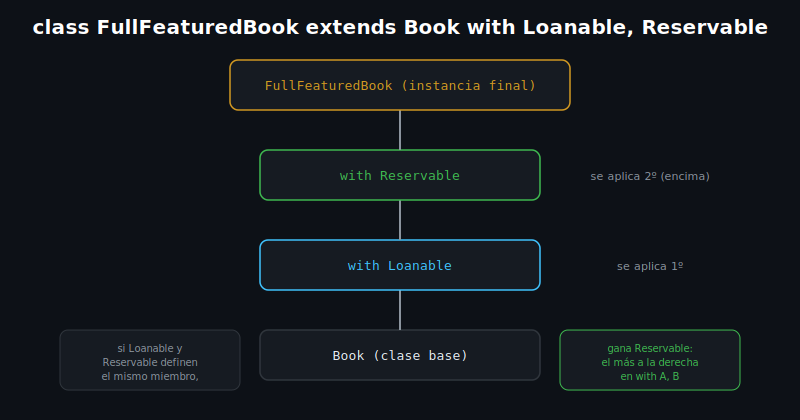

# Mixins

## 🎯 Objetivos

Al finalizar este archivo, comprenderás:

- Qué es un `mixin` y qué problema resuelve (reutilizar comportamiento sin herencia múltiple)
- La sintaxis `with` para aplicar uno o más mixins a una clase
- El orden de composición cuando se aplican varios mixins
- La cláusula `on` para restringir sobre qué tipos puede aplicarse un mixin



## 📋 Conceptos Clave

### 1. Declarar un mixin y aplicarlo con `with`

```dart
mixin Loanable {
  bool isOnLoan = false;

  void loan() {
    if (isOnLoan) throw StateError('Ya está prestado');
    isOnLoan = true;
  }

  void giveBack() => isOnLoan = false;
}

class Book {
  Book(this.title);
  final String title;
}

class LoanableBook extends Book with Loanable {
  LoanableBook(super.title);
}

void main() {
  final book = LoanableBook('Clean Code');
  book.loan();
  print(book.isOnLoan); // true
}
```

Un `mixin` empaqueta campos y métodos para **inyectarlos** en cualquier clase que use `with`,
sin que exista una relación de herencia real entre ellos. Resuelve el problema de "quiero
compartir este comportamiento entre clases que no comparten un padre común".

> 💡 **Comparación con otros lenguajes**: los mixins de Dart son conceptualmente parecidos a los
> traits de Rust/PHP o a los mixins de Ruby — una forma de composición horizontal, distinta de la
> herencia vertical de `extends`.

### 2. Combinar varios mixins — el orden importa

```dart
mixin Loanable {
  void loan() => print('Prestado');
}

mixin Reservable {
  void reserve() => print('Reservado');
}

class Book {}

class FullFeaturedBook extends Book with Loanable, Reservable {}

void main() {
  final book = FullFeaturedBook();
  book.loan();
  book.reserve();
}
```

Se pueden aplicar varios mixins separados por coma. Si dos mixins definen el **mismo** miembro,
el que aparece **más a la derecha** en `with A, B` gana (se aplica "encima" de los anteriores) —
por eso el orden de composición importa cuando hay solapamiento.

### 3. Restringir con `on` — el mixin exige un tipo base

```dart
class LibraryItem {
  LibraryItem(this.title);
  final String title;
}

mixin Trackable on LibraryItem {
  void logAccess() => print('Accediendo a: $title'); // usa un miembro de LibraryItem
}

class Book extends LibraryItem with Trackable {
  Book(super.title);
}

void main() {
  Book('Clean Code').logAccess(); // Accediendo a: Clean Code
}
```

La cláusula `on LibraryItem` declara que `Trackable` solo puede aplicarse a clases que ya sean
(o extiendan) `LibraryItem` — así el mixin puede usar con seguridad los miembros de esa clase
base (`title` arriba), y el analyzer rechaza aplicarlo a una clase incompatible.

### 4. `mixin` vs clase abstracta — cuándo usar cada uno

- **Mixin**: cuando quieres **inyectar comportamiento reutilizable** en clases que no comparten
  jerarquía (ej. `Loanable` aplicado tanto a `Book` como a `Equipment`)
- **Clase abstracta (`extends`)**: cuando modelas una relación real "es un" con un contrato
  compartido y una única línea de herencia

## ⚠️ Errores Comunes

- Intentar aplicar un mixin con `on` sobre una clase que no cumple la restricción — error de
  compilación
- Ignorar el orden en `with A, B` cuando ambos definen el mismo miembro — el de la derecha
  sobrescribe silenciosamente al de la izquierda
- Instanciar un `mixin` directamente (`Loanable()`) — un mixin no es una clase instanciable por
  sí sola, solo se aplica con `with`

## 📚 Recursos Adicionales

- [dart.dev — Mixins](https://dart.dev/language/mixins)

## ✅ Checklist de Verificación

Antes de continuar a las prácticas, verifica que entiendes:

- [ ] Cómo declarar un `mixin` y aplicarlo con `with`
- [ ] Qué pasa cuando dos mixins aplicados definen el mismo miembro
- [ ] Para qué sirve la cláusula `on` en un mixin
