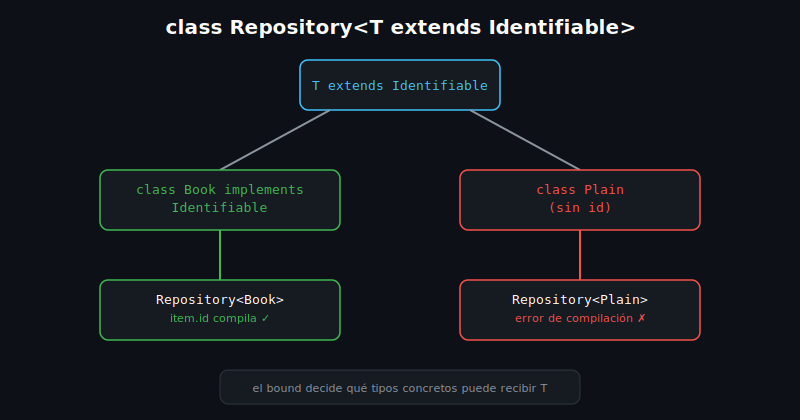

# Genéricos Básicos

## 🎯 Objetivos

Al finalizar este archivo, comprenderás:

- Qué problema resuelven los genéricos y por qué `dynamic` no es la solución
- Cómo declarar una clase genérica con uno o más parámetros de tipo
- Cómo acotar un tipo genérico con `extends` (bounded generics)
- Cómo declarar un método o función genérica independiente de una clase



## 📋 Conceptos Clave

### 1. El problema: `dynamic` pierde la seguridad de tipos

```dart
// ❌ Sin genéricos: dynamic acepta cualquier cosa, el analyzer no puede ayudarte
class LooseBox {
  LooseBox(this.value);
  dynamic value;
}

void main() {
  final box = LooseBox('Clean Code');
  final int broken = box.value; // compila, revienta en tiempo de ejecución
}
```

Los genéricos permiten escribir código reutilizable (una `Repository`, una `Box`) **sin**
renunciar a que el analyzer verifique los tipos en tiempo de compilación.

### 2. Clase genérica con un parámetro de tipo

```dart
class Repository<T> {
  final List<T> _items = [];

  void add(T item) => _items.add(item);

  List<T> get all => List.unmodifiable(_items);
}

class Book {
  const Book(this.title);
  final String title;
}

void main() {
  final repo = Repository<Book>();
  repo.add(Book('Clean Code'));
  print(repo.all.first.title); // Clean Code
}
```

`T` es un **parámetro de tipo**: un marcador de posición que se reemplaza por un tipo concreto
(`Book`) al instanciar `Repository<Book>`. El analyzer ya sabe que `repo.all` es `List<Book>`, no
`List<dynamic>`.

> 💡 **Comparación con otros lenguajes**: es el mismo mecanismo que `List<T>`/`ArrayList<T>` en
> Java o `Array<T>` en TypeScript — Dart no tiene wildcards (`? extends T` de Java), usa bounds
> directos con `extends`.

### 3. Bounded generics — `T extends X`

```dart
abstract class Identifiable {
  String get id;
}

class Repository<T extends Identifiable> {
  final List<T> _items = [];

  void add(T item) => _items.add(item);

  T? findById(String id) {
    for (final item in _items) {
      if (item.id == id) return item;
    }
    return null; // sin match
  }
}
```

El bound `extends Identifiable` le dice al compilador que **cualquier** `T` con el que se
instancie `Repository` tendrá un getter `id` — por eso `item.id` dentro de `findById` compila sin
casts. Sin el bound, `Repository<T>` (genérico "sin restricción") no podría acceder a `.id`
porque no sabría si `T` lo tiene.

### 4. Múltiples parámetros de tipo

```dart
class Pair<K, V> {
  const Pair(this.key, this.value);

  final K key;
  final V value;

  @override
  String toString() => '$key -> $value';
}

void main() {
  final entry = Pair<String, int>('Clean Code', 3);
  print(entry); // Clean Code -> 3
}
```

Una clase puede declarar varios parámetros de tipo (`K, V`), cada uno independiente — útil para
estructuras tipo mapa o resultado con dos valores relacionados.

### 5. Métodos y funciones genéricas independientes

```dart
T firstOrDefault<T>(List<T> items, T fallback) {
  return items.isEmpty ? fallback : items.first;
}

void main() {
  final titles = <String>[];
  print(firstOrDefault(titles, 'Sin título')); // Sin título
}
```

Una función también puede declarar su propio parámetro de tipo (`<T>` antes de los paréntesis),
sin pertenecer a ninguna clase genérica — Dart lo infiere del argumento en la mayoría de los
casos, sin necesidad de escribir `firstOrDefault<String>(...)` explícitamente.

## ⚠️ Errores Comunes

- Usar `dynamic` "para que funcione con cualquier tipo" en vez de un genérico — pierdes toda
  verificación del analyzer y el error aparece en producción, no al compilar
- Declarar `Repository<T>` sin bound y luego intentar acceder a un miembro específico (`item.id`)
  — no compila hasta que agregas `extends Identifiable`
- Confundir el parámetro de tipo de la clase (`class Repository<T>`) con el de un método
  genérico propio (`T firstOrDefault<T>(...)`) — son ámbitos distintos, aunque compartan el
  nombre `T`

## 📚 Recursos Adicionales

- [dart.dev — Generics](https://dart.dev/language/generics)

## ✅ Checklist de Verificación

Antes de continuar a las prácticas, verifica que entiendes:

- [ ] Por qué un genérico es más seguro que `dynamic`
- [ ] Cómo declarar y usar una clase con un parámetro de tipo (`T`)
- [ ] Qué aporta un bound (`T extends X`) frente a un genérico sin restricción
- [ ] Cómo declarar una función o método genérico propio
