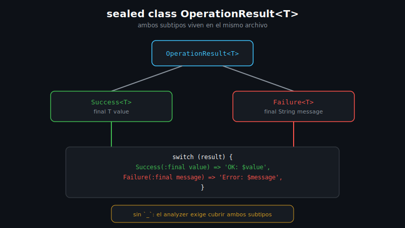

# Sealed Classes

## 🎯 Objetivos

Al finalizar este archivo, comprenderás:

- Qué es una `sealed class` y qué garantía extra le da al analyzer
- Cómo el analyzer verifica **exhaustividad** en un `switch` sobre una jerarquía sellada
- En qué se diferencia una `sealed class` de un `enum`
- Cómo combinar `sealed` + genéricos + pattern matching para modelar un resultado



## 📋 Conceptos Clave

### 1. Declarar una jerarquía sellada

```dart
sealed class SearchResult {
  const SearchResult();
}

class Found extends SearchResult {
  const Found(this.book);
  final Book book;
}

class NotFound extends SearchResult {
  const NotFound(this.query);
  final String query;
}

class Book {
  const Book(this.title);
  final String title;
}
```

`sealed` obliga a que **todos** los subtipos directos se declaren en la misma biblioteca (mismo
archivo, o archivos unidos con `part`). Gracias a esa restricción, el analyzer conoce el conjunto
**completo** de subtipos posibles — algo que una clase abstracta normal no garantiza (cualquiera
podría extenderla desde otro archivo).

### 2. Exhaustividad en `switch` — la razón de ser de `sealed`

```dart
String describe(SearchResult result) => switch (result) {
  Found(:final book) => 'Encontrado: ${book.title}',
  NotFound(:final query) => 'Sin resultados para "$query"',
};
```

Este `switch` expression **no necesita** un `_` final. Como `SearchResult` es `sealed`, el
analyzer sabe que solo existen `Found` y `NotFound` — si más adelante agregas un tercer subtipo
(ej. `Ambiguous`) y olvidas cubrirlo aquí, `dart analyze` marca error de inmediato. Esa
verificación en tiempo de compilación es la ventaja central frente a una clase abstracta común.

### 3. `sealed class` vs `enum`

- **`enum`** (incluso "enhanced" con campos): un conjunto fijo de **instancias** de la **misma**
  clase — todas comparten la misma forma de datos
- **`sealed class`**: un conjunto fijo de **tipos**, cada uno con sus propios campos y forma —
  `Found` tiene un `Book`, `NotFound` tiene un `String query`; son estructuras distintas, no
  variantes de una misma forma

Usa `sealed` cuando cada variante necesita **datos diferentes** entre sí (el caso típico de un
resultado "éxito con valor" vs "error con mensaje"); usa `enum` cuando todas las variantes
comparten exactamente la misma forma de datos.

### 4. Combinar `sealed` con genéricos — el patrón `Result`

```dart
sealed class OperationResult<T> {
  const OperationResult();
}

class Success<T> extends OperationResult<T> {
  const Success(this.value);
  final T value;
}

class Failure<T> extends OperationResult<T> {
  const Failure(this.message);
  final String message;
}

String render(OperationResult<Book> result) => switch (result) {
  Success(:final value) => 'OK: ${value.title}',
  Failure(:final message) => 'Error: $message',
};
```

Esta combinación — genérico (`<T>`) + sellado (`sealed`) + pattern matching (`switch`
exhaustivo) — es el cierre de los cuatro temas de la semana: un `OperationResult<T>` reutilizable
para **cualquier** tipo `T`, con exhaustividad garantizada en cada lugar donde se consuma.

## ⚠️ Errores Comunes

- Intentar declarar un subtipo de una `sealed class` en **otro** archivo — error de compilación
  (`sealed` exige que todos los subtipos directos vivan en la misma biblioteca)
- Agregar un `_` innecesario en un `switch` ya exhaustivo sobre un tipo `sealed` — pierdes la
  ventaja principal: que el analyzer te avise si falta cubrir un caso nuevo
- Modelar con `sealed class` algo que en realidad es un conjunto fijo de valores sin datos
  propios — ahí un `enum` simple es más que suficiente y más barato

## 📚 Recursos Adicionales

- [dart.dev — Sealed classes](https://dart.dev/language/class-modifiers#sealed)
- [dart.dev — Patterns: exhaustiveness checking](https://dart.dev/language/patterns#exhaustiveness-checking)

## ✅ Checklist de Verificación

Antes de continuar a las prácticas, verifica que entiendes:

- [ ] Qué garantiza `sealed` sobre los subtipos de una clase
- [ ] Por qué un `switch` exhaustivo sobre un tipo `sealed` no necesita `_`
- [ ] La diferencia entre modelar con `sealed class` y modelar con `enum`
- [ ] Cómo se combinan genéricos, `sealed` y pattern matching en un patrón `Result`
