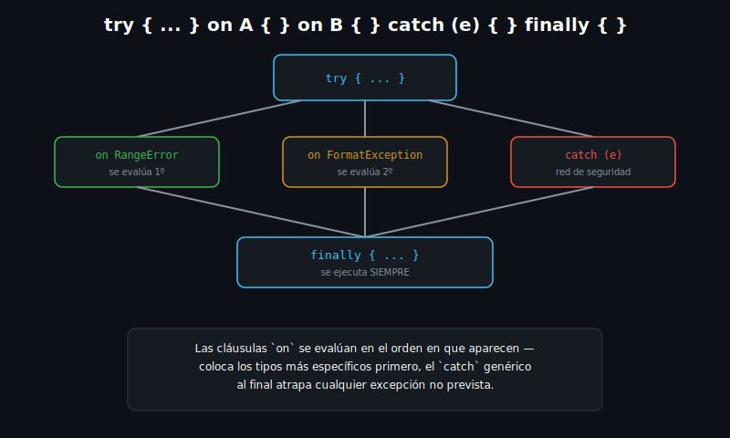

# Try, Catch y Finally

## 🎯 Objetivos

Al finalizar este archivo, comprenderás:

- Cómo capturar una excepción con `try`/`catch` y por qué el programa no se detiene abruptamente
- Cómo capturar un tipo específico de excepción con `on`
- Para qué sirve el bloque `finally` y cuándo se ejecuta
- Cómo relanzar una excepción con `rethrow` sin perder su stack trace original



## 📋 Conceptos Clave

### 1. `try`/`catch` básico

```dart
void main() {
  try {
    final result = 10 ~/ 0; // división entera por cero
    print(result);
  } catch (e) {
    print('Ocurrió un error: $e');
  }
  print('El programa continúa'); // esto SÍ se imprime
}
```

Sin `try`/`catch`, una excepción no manejada **detiene el programa**. Capturarla permite
reaccionar (loguear, mostrar un mensaje, reintentar) y seguir ejecutando.

### 2. `on TipoDeExcepcion` — capturar un tipo específico

```dart
void main() {
  try {
    final numbers = <int>[1, 2, 3];
    print(numbers[10]); // índice fuera de rango
  } on RangeError {
    print('Índice fuera de rango');
  } on FormatException {
    print('Formato inválido'); // no aplica aquí, pero coexiste con RangeError
  } catch (e) {
    print('Error inesperado: $e'); // atrapa cualquier otra cosa
  }
}
```

Varias cláusulas `on` permiten reaccionar **distinto** según el tipo de excepción. Dart evalúa
las cláusulas **en orden**: coloca los tipos más específicos primero — un `catch` genérico al
final actúa como red de seguridad para lo no previsto.

### 3. Acceso al stack trace

```dart
void main() {
  try {
    throw StateError('Estado inválido');
  } catch (e, stackTrace) {
    print('Error: $e');
    print('Stack trace disponible: ${stackTrace.toString().isNotEmpty}');
  }
}
```

El segundo parámetro de `catch` es el `StackTrace` — útil para logging detallado en apps reales,
aunque en los ejemplos de este curso solo se imprime su existencia.

### 4. `finally` — se ejecuta siempre

```dart
void readConfig(bool shouldFail) {
  try {
    if (shouldFail) throw Exception('Config corrupta');
    print('Config leída correctamente');
  } catch (e) {
    print('No se pudo leer: $e');
  } finally {
    print('Cerrando conexión al archivo'); // ocurre haya o no excepción
  }
}
```

El bloque `finally` se ejecuta **siempre** — haya ocurrido una excepción o no, e incluso si el
`catch` la relanza. Es el lugar correcto para liberar recursos (cerrar un archivo, una conexión).

### 5. `rethrow` — relanzar sin perder el stack trace original

```dart
void process() {
  try {
    throw FormatException('Dato corrupto');
  } catch (e) {
    print('Log local: $e');
    rethrow; // vuelve a lanzar LA MISMA excepción, con su stack trace intacto
  }
}

void main() {
  try {
    process();
  } catch (e) {
    print('Capturado en main: $e');
  }
}
```

`rethrow` es distinto de `throw e`: `rethrow` conserva el stack trace **original** (dónde
ocurrió realmente el error), mientras que `throw e` generaría uno nuevo apuntando al `throw`,
perdiendo la traza real del problema.

## ⚠️ Errores Comunes

- Poner un `catch` genérico **antes** que un `on` específico — el genérico lo captura todo
  primero y el `on` específico nunca se alcanza
- Usar `throw e` para relanzar en vez de `rethrow` — se pierde el stack trace original,
  dificultando el diagnóstico
- Olvidar que `finally` se ejecuta incluso si el `catch` relanza la excepción — no asumas que un
  `return`/`rethrow` dentro del `catch` salta el `finally`

## 📚 Recursos Adicionales

- [dart.dev — Exceptions](https://dart.dev/language/error-handling#exceptions)

## ✅ Checklist de Verificación

Antes de continuar a las prácticas, verifica que entiendes:

- [ ] Por qué capturar una excepción evita que el programa se detenga
- [ ] Cómo y por qué ordenar varias cláusulas `on` de más a menos específica
- [ ] Cuándo se ejecuta `finally` y para qué se usa
- [ ] La diferencia entre `rethrow` y `throw e`
