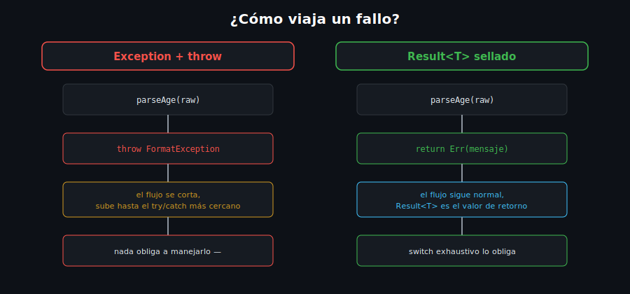

# El Patrón Result

## 🎯 Objetivos

Al finalizar este archivo, comprenderás:

- Qué problema del control de flujo resuelve modelar un fallo como **valor** en vez de excepción
- Cómo declarar un `Result<T>` con `sealed class` (retomando la semana 6)
- Cómo consumir un `Result<T>` con `switch` exhaustivo (retomando pattern matching)
- Cuándo preferir `Result` sobre lanzar una excepción, y cuándo no



## 📋 Conceptos Clave

### 1. El problema: una excepción no aparece en la firma del método

```dart
// ¿Esta función puede fallar? Nada en su firma lo indica.
int parseAge(String raw) => int.parse(raw); // lanza FormatException si raw no es un número
```

Quien llama a `parseAge` no tiene forma de saber, **solo mirando el tipo de retorno**, que puede
fallar — debe leer la documentación o el código fuente. Si olvida el `try`/`catch`, el programa
se detiene en producción con la excepción sin manejar.

### 2. `Result<T>` — el fallo es parte del tipo de retorno

```dart
sealed class Result<T> {
  const Result();
}

class Ok<T> extends Result<T> {
  const Ok(this.value);
  final T value;
}

class Err<T> extends Result<T> {
  const Err(this.message);
  final String message;
}

Result<int> parseAge(String raw) {
  final value = int.tryParse(raw);
  if (value == null) return Err('"$raw" no es un número válido');
  return Ok(value);
}
```

Ahora la firma `Result<int> parseAge(String raw)` **documenta** que la operación puede fallar —
el compilador obliga a quien la consuma a considerar ambos casos (ver siguiente punto).

### 3. Consumir un `Result<T>` con `switch` exhaustivo

```dart
void main() {
  final result = parseAge('25');

  final message = switch (result) {
    Ok(:final value) => 'Edad válida: $value',
    Err(:final message) => 'Error: $message',
  };

  print(message);
}
```

Como `Result<T>` es `sealed`, el `switch` **no necesita** un `_` — el analyzer ya sabe que solo
existen `Ok` y `Err`. Si mañana agregas un tercer subtipo, todo `switch` que no lo cubra falla en
`dart analyze`, no en producción.

### 4. `Exception`/`throw` vs `Result` — cuándo usar cada uno

| Situación                                              | Usa               |
| ------------------------------------------------------- | ------------------ |
| Falla **esperada y frecuente** de la lógica de negocio (validación de un formulario) | `Result<T>`        |
| Condición **verdaderamente excepcional** (archivo no encontrado, red caída)          | `Exception` + `throw` |
| Bug del programador (índice inválido, estado imposible)                             | `Error` (no lo captures, corrige el código) |

`Result` no reemplaza a las excepciones — conviven. Una función de validación de negocio suele
retornar `Result<T>`; una operación de bajo nivel (leer un archivo) sigue lanzando `Exception`
cuando el sistema operativo falla.

## ⚠️ Errores Comunes

- Usar `Result<T>` para **todo**, incluyendo errores verdaderamente excepcionales — termina
  ensuciando cada función con casos que en la práctica casi nunca ocurren
- Olvidar declarar `Result<T>` como `sealed` — pierdes la exhaustividad del `switch`, la ventaja
  principal del patrón
- Ignorar el caso `Err` accediendo directamente al valor sin pasar por el `switch` — reintroduce
  el mismo problema que las excepciones no manejadas

## 📚 Recursos Adicionales

- [dart.dev — Sealed classes](https://dart.dev/language/class-modifiers#sealed)
- [dart.dev — Patterns](https://dart.dev/language/patterns)

## ✅ Checklist de Verificación

Antes de continuar a las prácticas, verifica que entiendes:

- [ ] Por qué una excepción no aparece en la firma de una función
- [ ] Cómo declarar `Result<T>` con `sealed class` y sus dos variantes `Ok`/`Err`
- [ ] Cómo consumir un `Result<T>` con `switch` exhaustivo
- [ ] Cuándo preferir `Result` sobre una excepción, y viceversa
